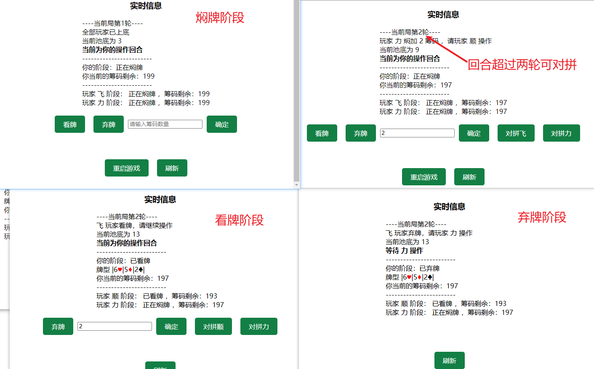
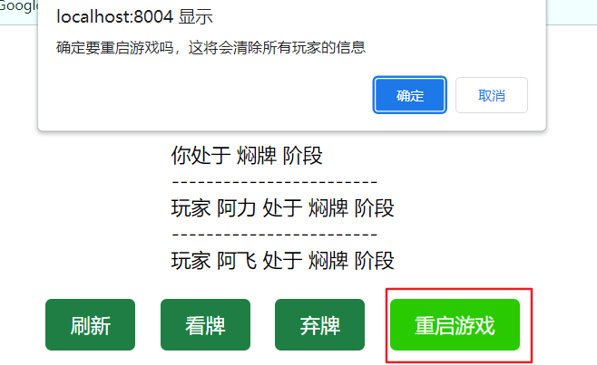
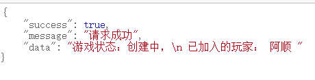

# 使用说明

### 1.加入对局

+ 访问游戏首页加入对局，ip/page/index
+ 第一位玩家加入，将会成为 **房主**
+ 房主拥有操作房间的权限，如开始游戏、开始下一局、重启游戏等

### 2.开始游戏

+ 玩家等待游戏开启
+ 房主开始游戏权限，加入游戏的玩家数量在 2~10 人之间可以开始游戏

### 3.对局

+ 焖牌阶段所有玩家看不到牌型
+ 看牌阶段仅自己可见，其他玩家看不到
+ 看牌上的筹码是前一轮焖牌的两倍
+ 加注上限默认焖10看20

### 4.对局结算

+ 经过弃牌/对拼后，只剩唯一玩家时触发对局结算
+ 自动进入下一轮对局
+ 最上侧展示上一局的结果

### 5. 房主重启游戏

+ 重启游戏将会清除所有玩家信息，再次游戏需要重新加入

### 附加-后门查询玩家信息
+ ip/manager/queryGameInfo 目前仅能查看加入玩家的姓名

