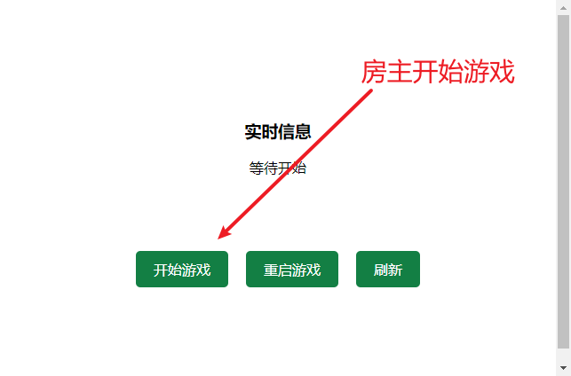
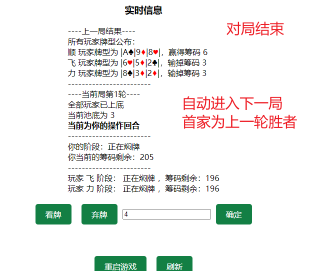
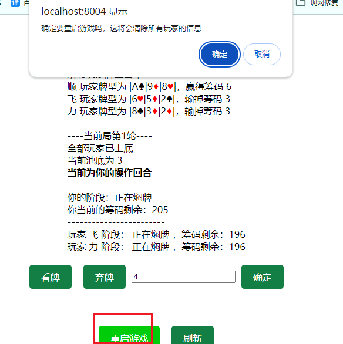

# 使用说明

### 1.加入对局

+ 访问游戏首页加入对局，ip/page/index
+ 第一位玩家加入，将会成为 **房主**
+ 房主拥有操作房间的权限，如开始游戏、开始下一局、重启游戏等

### 2.等待游戏开始

+ 玩家等待游戏开启
+ 房主开始游戏权限，加入游戏的玩家数量在 2~10 人之间可以开始游戏

### 3.玩家准备
+ 全部玩家准备后将进入对局阶段

### 4.对局

+ 焖牌阶段所有玩家看不到牌型
+ 看牌阶段仅自己可见，其他玩家看不到
+ 弃牌阶段所有玩家可见

### 5.下一轮对局

+ 当所有玩家弃牌后，房主拥有开启下一轮对局的按钮权限，点击后玩家进入准备阶段

### 6. 房主重启游戏

+ 重启游戏将会清除所有玩家信息，再次游戏需要重新加入

### 7.后门查询玩家信息
+ ip/manager/queryGameInfo 目前仅能查看加入玩家的姓名

